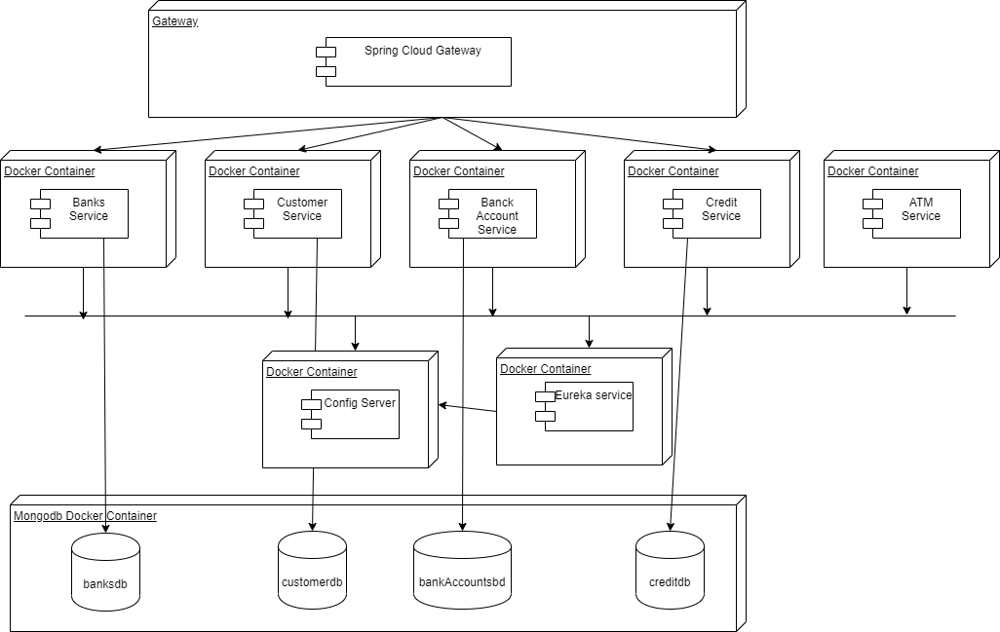

# Project4 updated - ATM Service
Java Spring Boot Backend.

### Command for run Dockerfile and start container
cd /atm

docker-compose up -d

### Sonarqube
docker run -d --name sonarqube -p 8090:9000 sonarqube

## Arquitectura de Microservicio
